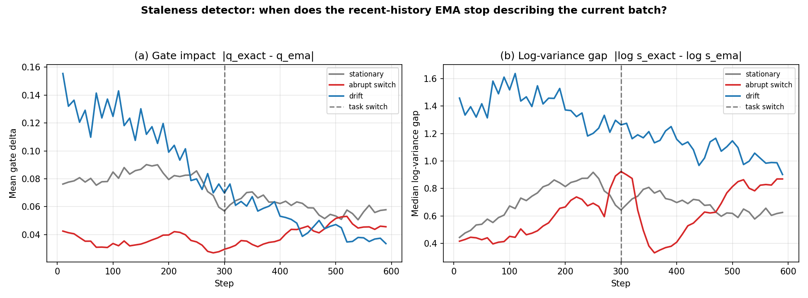
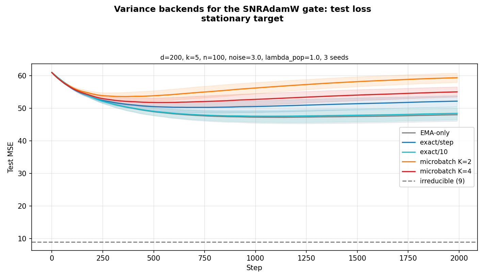
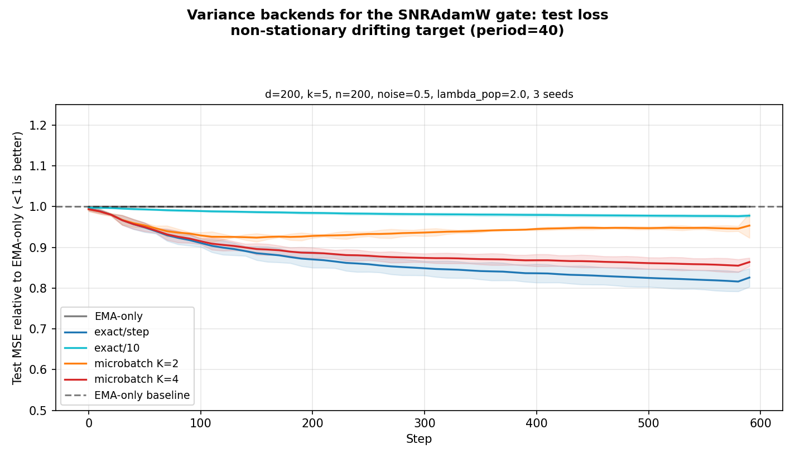
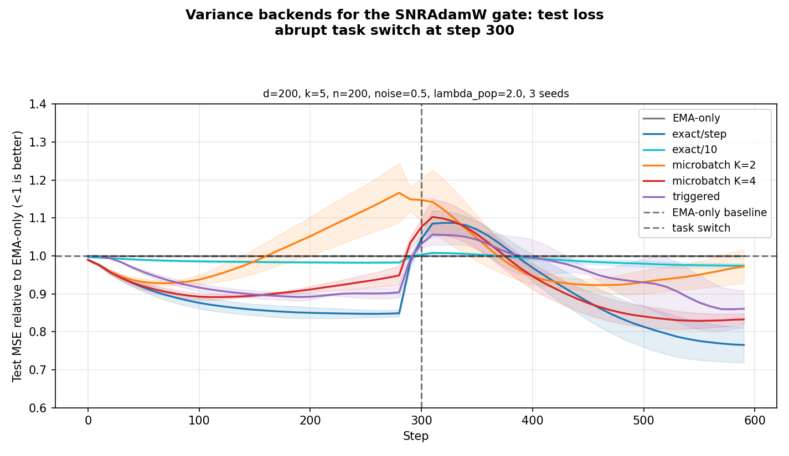
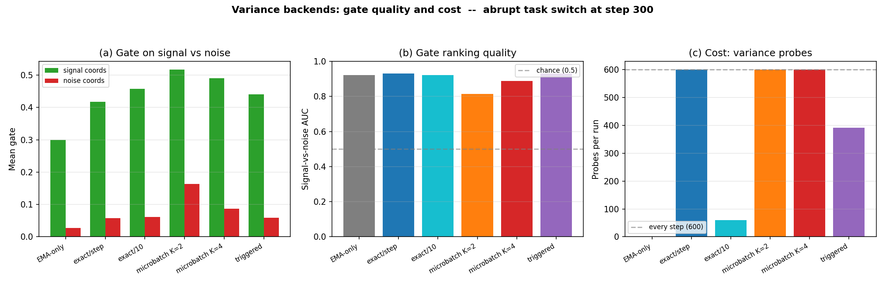
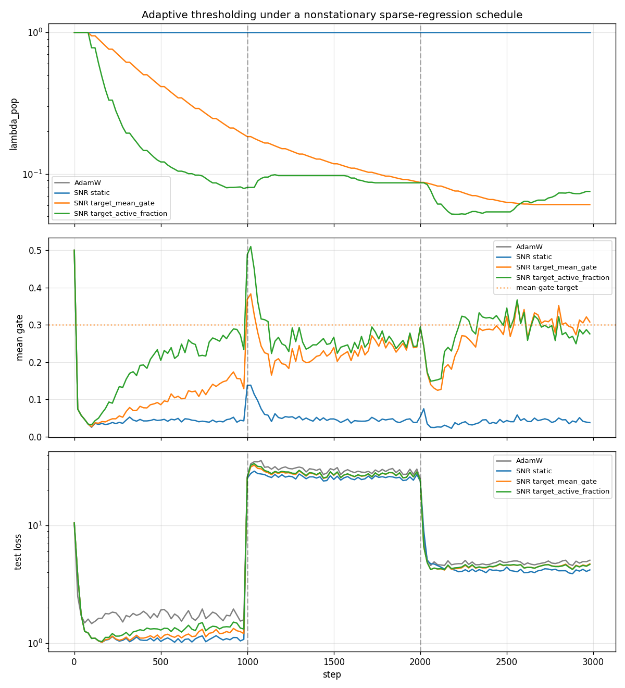

# snr-grad

A PyTorch optimizer that adds an SNR / population-risk gate to AdamW, based on [arXiv:2605.01172](https://arxiv.org/abs/2605.01172).

The gate suppresses parameter updates that are dominated by gradient noise, allowing only updates with a strong signal-to-noise ratio to pass through.

## Installation

Install directly from GitHub:

```bash
uv pip install git+https://github.com/mattsq/snr-grad.git
```

Or clone and install in editable mode for development:

```bash
git clone https://github.com/mattsq/snr-grad.git
cd snr-grad
uv pip install -e .
```

## Quick start

`SNRAdamW` can be used in place of `torch.optim.AdamW` in standard training loops:

```python
from snr_grad import SNRAdamW

optimizer = SNRAdamW(
    model.parameters(),
    lr=3e-4,
    weight_decay=0.01,
)

# Standard training loop
loss.backward()
optimizer.step()
optimizer.zero_grad(set_to_none=True)
```

## Gate types

Three gating strategies are available via the `gate` parameter:

| Gate     | Formula | Notes |
|----------|---------|-------|
| `"snr"`  | `m^2 / (m^2 + l*s + eps)` | **Default.** Smooth SNR shrinker, robust out of the box |
| `"soft"` | `relu(m^2 - a*s) / (relu(m^2 - a*s) + l*s + eps)` | Paper Algorithm 1. Has hard threshold floor at `m^2 = a*s` |
| `"hard"` | `1[m^2 > a*s]` | Binary gate for ablations |

Where `m` = bias-corrected first moment, `s` = bias-corrected gradient variance EMA, `a` = alpha, `l` = lambda_pop.

> **Why `"snr"` is the default instead of the paper's `"soft"`:** The soft gate has a hard
> threshold floor — when `m^2 < alpha * s`, the gate is exactly zero. In practice this can
> shut down too many parameters, especially in overparameterized models where most gradients
> are noisy. The SNR gate degrades gracefully: every parameter gets an update proportional to
> its signal-to-noise ratio, with no cliff. It is also less sensitive to `alpha` and
> `lambda_pop`, making it easier to use without tuning. Use `gate="soft"` if you want the
> paper's exact Algorithm 1 formulation.

```python
optimizer = SNRAdamW(model.parameters(), lr=3e-4, gate="soft")  # paper default
```

## Finite-dataset correction

For finite datasets, set `alpha="finite"` with dataset metadata to use the leave-one-out coefficient `alpha = b / (n - b)`:

```python
optimizer = SNRAdamW(
    model.parameters(),
    lr=3e-4,
    alpha="finite",
    batch_size=128,
    dataset_size=len(train_dataset),
)
```

`alpha` also accepts `"online"` (equivalent to `1.0`, the default) or any numeric value.

## Freezing low-SNR parameters to save backward compute

The gate `q` already suppresses noise-dominated updates, but the backward pass still computes the gradients and stores the activations needed for them. When a parameter's gate sits near zero for many consecutive steps, those resources are wasted. Setting `freeze_low_snr=True` makes the optimizer track an EMA of each parameter's gate and call `p.requires_grad_(False)` once the EMA has been below `freeze_threshold` for `freeze_patience` steps. PyTorch's autograd then propagates `needs_input_grad=False` through the subgraph: when every leaf in a module is frozen, its activations are not retained and its backward kernels do not run. Frozen parameters are re-enabled every `freeze_recheck_interval` steps so they can recover if their signal returns.

```python
optimizer = SNRAdamW(
    model.parameters(),
    lr=3e-4,
    freeze_low_snr=True,
    freeze_threshold=0.05,
    freeze_patience=200,
    freeze_recheck_interval=1000,
    freeze_beta=0.99,
)
```

The same flag works on all four optimizers (`SNRAdamW`, `SNRMuon`, `RotatedSNRAdamW`, `SpectralSNRMuon`). Each exposes an `opt.count_frozen()` method returning `(parameters_frozen, elements_frozen)`; `SNRAdamW` additionally reports these in `opt.last_stats` when `track_stats=True`. Parameters the user has already set to `requires_grad=False` are not touched by the recheck. `benchmark_freeze.py` compares the freeze and baseline arms on an overparameterized MLP.

## Adaptive thresholding (self-tuning the gate)

A fixed threshold says "suppress gradients when `m^2/s` is below a manually chosen boundary". As gradient statistics drift during training — noise level changes, the signal support moves — that fixed boundary stops meaning the same thing, so the gate quietly becomes too permissive or too suppressive. Adaptive thresholding instead *chooses* the boundary so the gate maintains a target behaviour.

Pass an `adaptive_threshold` config (a dataclass or a plain dict) to `SNRAdamW` or `MARSSNRAdamW`. The controller adapts `lambda_pop` (by default) per parameter group, leaving your original setting recorded as `base_lambda_pop`. Two modes are implemented:

- **`target_mean_gate`** — keep the average gate value near a target. Robust and general.
- **`target_active_fraction`** — keep a target fraction of coordinates "active" (`q >= active_gate_threshold`), via a closed-form quantile solve. More interpretable: "let roughly 20% of coordinates through strongly".

```python
from snr_grad import SNRAdamW, AdaptiveThresholdConfig

# Hold the average gate near 0.25, adapting lambda_pop.
optimizer = SNRAdamW(
    model.parameters(),
    lr=3e-4,
    gate="snr",
    adaptive_threshold=AdaptiveThresholdConfig(
        mode="target_mean_gate",
        target_mean_gate=0.25,
        update_interval=50,
        warmup_steps=100,
    ),
)

# Or keep the top ~20% of coordinates strongly active (dict form also works).
optimizer = SNRAdamW(
    model.parameters(),
    lr=3e-4,
    gate="snr",
    adaptive_threshold={
        "mode": "target_active_fraction",
        "target_active_fraction": 0.2,
        "active_gate_threshold": 0.5,
    },
)
```

Thresholds update only every `update_interval` steps and only after `warmup_steps`; small deviations inside `tolerance` are ignored and each update's log-space move is capped by `max_log_change`, so the threshold tracks sustained shifts without chattering. Adaptation is per parameter group, so you can mix policies:

```python
optimizer = SNRAdamW(
    [
        {"params": model.embedding.parameters(), "adaptive_threshold": {"mode": "off"}},
        {"params": model.blocks.parameters(),    "adaptive_threshold": {"mode": "target_active_fraction"}},
        {"params": model.head.parameters(),      "adaptive_threshold": {"mode": "target_mean_gate"}},
    ],
    lr=3e-4,
)
```

Inspect or reset the live state with `optimizer.get_threshold_state()` and `optimizer.reset_threshold_state()`. The adaptive state is saved and restored through `state_dict()` / `load_state_dict()`. `benchmark_adaptive_threshold.py` runs a nonstationary sparse-regression schedule (noise jump, then a shift in the signal support) and shows the static gate drifting away from its operating point while the adaptive gates recalibrate to hold their target.

## Exact and cheap variance estimation

The SNR gate compares `m_hat**2` against an estimate of the variance of the **minibatch
mean gradient**, `s`. `SNRAdamW` maintains a cheap streaming EMA of `s` internally, but
you can supply a better per-step estimate through the `grad_variances` hook:

```python
optimizer.step(grad_variances={param: s_tensor})
```

When supplied for a parameter, `s_tensor` replaces the EMA in the gate for that step
(the internal EMA is still updated for continuity). The `snr_grad.variance` module
provides interchangeable backends that produce these dictionaries, all on the same scale
as the internal `s_hat` (unbiased per-example gradient variance divided by batch size,
matching `per_sample_variance_term`).

### Exact probe (per-sample gradients)

`ExactVarianceEstimator` computes the exact diagonal variance using `torch.func`
per-sample gradients (`grad` + `vmap`). You provide a per-example loss
`loss_one_sample(params, buffers, sample)` that returns one example's scalar loss; the
estimator handles `vmap`-ing it over the batch:

```python
from snr_grad import SNRAdamW, ExactVarianceEstimator
from torch.func import functional_call

def loss_one_sample(params, buffers, sample):
    x, y = sample
    pred = functional_call(model, (params, buffers), (x.unsqueeze(0),))
    return ((pred.squeeze(0) - y) ** 2).sum()   # per-example loss

estimator = ExactVarianceEstimator(chunk_size=16)   # chunk_size trades memory for speed

optimizer.zero_grad(set_to_none=True)
loss = ((model(x) - y) ** 2).mean()
loss.backward()
grad_variances = estimator.estimate(model, loss_one_sample, (x, y))
optimizer.step(grad_variances=grad_variances)
```

`ExactVarianceEstimator` computes in fp32 by default (robust under mixed precision) and
casts the result back to each parameter's dtype. Use `include_params` / `exclude_params`
(name substrings) to restrict which parameters are differentiated — exact per-sample
gradients for large embeddings or output heads can dominate memory. Normalization-layer
parameters are excluded by default (`exclude_norm=True`).

For an exact-every-K-steps cadence, just call `estimate` only when `step % K == 0` and
pass `grad_variances=None` (or omit it) on the other steps, so the EMA is used in between.

### Cheap microbatch estimate (split-batch)

`backward_with_microbatch_variance` splits the minibatch into `K` chunks, runs one
ordinary backward per chunk, and estimates `s = Var_unbiased(chunk_means) / K` (for
`K=2` this is `(h_1 - h_2)**2 / 4`). It **owns the backward pass** and leaves the
full-batch mean gradient in each `param.grad`, so no separate `loss.backward()` is needed:

```python
from snr_grad import backward_with_microbatch_variance

def loss_fn(model, sub_batch):
    x, y = sub_batch
    return ((model(x) - y) ** 2).mean()

optimizer.zero_grad(set_to_none=True)
loss, grad_variances = backward_with_microbatch_variance(
    model, loss_fn, (x, y), num_splits=4,
)
optimizer.step(grad_variances=grad_variances)
```

This needs only `K` backward passes instead of per-example gradients, so it scales to
larger models, but the estimate is noisier (especially at `K=2`). The thin wrapper
`MicrobatchVarianceEstimator(num_splits=...)` exposes the same `.estimate(model, loss_fn,
batch)` interface and stores the loss on `.last_loss`.

### Diagnostics

`compare_gate_with_external_variance(optimizer, grad_variances)` answers "would this
variance estimate actually change the gate?" without mutating optimizer state. It returns
the mean internal/external `s`, their ratio, the EMA-vs-external gate means, the fraction
of elements whose gate changes by more than 0.25, and the log-variance correlation.

### When is a better estimate than the EMA worth it?

The internal EMA estimates variance *over time*, which matches the within-batch sampling
variance only when the gradient distribution is stationary. Its blind spot is
**non-stationarity**: on a coordinate whose true gradient is large and changing,
`(g_t - m_{t-1})^2` is inflated by the drift, so the EMA over-estimates variance and the
gate suppresses signal it should pass. Exact and microbatch estimators measure variance
within the current batch and are immune to this. On synthetic non-stationary tasks (a
drifting target, or an abrupt task switch) the EMA over-estimates signal-coordinate variance
by ~10x, and switching to an exact or microbatch estimate cuts tracking error by ~14-24%; on
a stationary task the EMA is already well-calibrated and the cheap estimators add no value
(or slightly hurt). This reframes the goal from "better variance estimation" to **adaptive
variance freshness**: detect when the EMA is stale (the exact and EMA gates diverge) and
spend exact probes only then. See the `benchmark_variance_estimators.py` entry under
[Benchmarks](#benchmarks) for the staleness detector, the three regimes, and an adaptive
`triggered` controller.

### Limitations

- Exact per-sample gradients require a deterministic model: control dropout / RNG, or the
  estimate includes model stochasticity.
- BatchNorm in train mode couples examples through batch statistics; its parameters are
  excluded from exact probes by default and a warning is emitted.
- Microbatch variance is biased if the chunks are not comparable (e.g. strong augmentation
  differences or stateful layers), and is high-variance at small `K`.
- Estimates are local to the current process; distributed aggregation is out of scope.


## Experimental extensions

This repo includes several experimental optimizers that extend SNR gating to matrix-aware update strategies for 2D weight parameters. Non-2D parameters (biases, norms, vectors) fall back to standard SNR-gated AdamW-style updates in all variants.

### `SNRMuon` -- SNR-gated Muon orthogonalization

Combines SNR gating with Muon-style Newton-Schulz orthogonalization for 2D parameters:

- `muon_mode="post"` (default): `q * Ortho(update)` -- gate the orthogonalized update
- `muon_mode="pre"`: `Ortho(q * update)` -- orthogonalize the gated update

```python
from snr_grad import SNRMuon

optimizer = SNRMuon(
    model.parameters(),
    lr=3e-4,
    gate="snr",
    muon_mode="post",
    muon_ns_steps=5,
)
```

### `RotatedSNRAdamW` -- Eigenbasis-rotated SNR gating

SOAP-style optimizer that maintains running estimates of the left and right gradient covariance matrices, periodically computes their eigenbases, and applies SNR gating in the rotated coordinate frame. This allows the gate to operate along the natural axes of gradient variation rather than the parameter axes.

```python
from snr_grad import RotatedSNRAdamW

optimizer = RotatedSNRAdamW(
    model.parameters(),
    lr=1e-3,
    gate="snr",
    basis_beta=0.95,            # EMA for covariance tracking
    basis_update_interval=50,   # re-compute eigenbasis every N steps
)
```

### `SpectralSNRMuon` -- SVD-basis SNR gating

Applies SNR gating in the singular value decomposition (SVD) basis of the momentum matrix. Two modes control the granularity of gating, and two variants control how the gated coefficients are used:

| Parameter | Options | Description |
|-----------|---------|-------------|
| `mode` | `"diag"` / `"full"` | Gate per singular value, or gate the full spectral coefficient matrix |
| `variant` | `"adam_spectral_gate"` / `"muon_spectral_gate"` | Include Adam-style v_hat normalisation, or use raw gated coefficients |

```python
from snr_grad import SpectralSNRMuon

optimizer = SpectralSNRMuon(
    model.parameters(),
    lr=1e-3,
    gate="snr",
    mode="diag",                    # "diag" or "full"
    variant="adam_spectral_gate",   # "adam_spectral_gate" or "muon_spectral_gate"
)
```

### Grokfast integration -- Slow-gradient pre-amplification

We have integrated **Grokfast** (a technique that tracks and amplifies slow-varying components of the gradients to accelerate generalization and grokking) into all four optimizer classes: `SNRAdamW`, `SNRMuon`, `RotatedSNRAdamW`, and `SpectralSNRMuon`.

Grokfast operates via a **Pre-Gate Amplification** strategy: the slow-gradient moving average is computed and added to the gradient *before* the moments and SNR gates are calculated. This helps push parameters out of sharp local minima towards flat, broad valleys that generalize better.

To enable Grokfast slow-gradient amplification, pass `grokfast_alpha` and `grokfast_lamb` when initializing any of the optimizers:

```python
from snr_grad import SNRAdamW

optimizer = SNRAdamW(
    model.parameters(),
    lr=1e-3,
    grokfast_alpha=0.98,  # EMA decay factor for slow-gradient tracking
    grokfast_lamb=2.0,    # slow-gradient amplification strength
)
```

#### Important Guidance: The Underdetermined vs. Overdetermined Trade-off

Based on rigorous regime sweeps on high-dimensional sparse regression, Grokfast slow-gradient amplification exhibits a critical trade-off:

1. **Underdetermined Regime ($n < d$, e.g., small datasets, high noise):**
   - **Do not use standard Grokfast.** In underdetermined settings, spurious correlations create persistent, static noise-fitting gradients. Grokfast will track and *amplify* this persistent noise-fitting component, leading to severe overfitting.
   - If Grokfast is required, always pair it with the SNR gate (`grokfast_lamb > 0` and `lambda_pop > 0.0`), which acts as an adaptive filter to block the noise-amplifying updates.
2. **Overdetermined Regime ($n > d$, e.g., large clean datasets):**
   - **Highly Recommended.** When training data is abundant, the true signals have consistent, slow-moving gradients while noise cancels out. Grokfast excels in this well-determined regime, dramatically accelerating signal learning and slashing test MSE.

### `MARSSNRAdamW` -- MARS Variance-Reduced SNR Optimizer

Combines **ByteDance's MARS (Make Variance Reduction Shine, ICML 2025)** variance-reduction technique with SNR population-risk gating. It tracks historical gradient differences to construct a variance-reduced gradient direction, L2-clips it to prevent optimization spikes under heavy noise, and filters residual noise via the SNR gate.

Additionally, this optimizer features:
1. **Configurable 1D Fallback (`optimize_1d`)**: Controls whether 1D parameters (biases, layer norm gains, embedding parameters) are optimized via MARS variance reduction or fall back to standard `SNRAdamW`.
2. **Optional Caution (`caution`)**: Integrates the "caution" mechanism (from Cautious Optimizers, arXiv:2411.16085) to sign-mask momentum updates based on alignment with the current gradient direction.

```python
from snr_grad import MARSSNRAdamW

optimizer = MARSSNRAdamW(
    model.parameters(),
    lr=1e-3,
    weight_decay=0.01,
    gate="snr",             # "snr", "soft", or "hard"
    gamma=0.025,            # STORM variance reduction scaling factor
    mars_clip=1.0,          # L2 norm clipping threshold for corrected gradient (optional)
    optimize_1d=False,      # fallback 1D params to standard SNRAdamW
    caution=True,           # apply cautious sign-alignment masking
)
```

### ScheduleFree integration -- Iterate averaging without LR schedules

We provide ScheduleFree (Defazio et al., [arXiv:2405.15682](https://arxiv.org/abs/2405.15682)) variants of all four optimizer classes:

- `SNRScheduleFreeAdamW`
- `SNRScheduleFreeMuon`
- `RotatedSNRScheduleFreeAdamW`
- `SpectralSNRScheduleFreeMuon`

ScheduleFree replaces the need for LR schedules (warmup/cosine/linear) with built-in Polyak-Ruppert iterate averaging. The model parameters hold the gradient-evaluation point `y = (1 - sf_beta) * z + sf_beta * x` during training; the averaged iterate `x` (used at inference) is reconstructed on demand. The SNR gate is computed exactly as before and filters the per-step Adam-normalized gradient that drives the base sequence `z`. Adam's first moment `m_hat` is used *only* to compute the gate -- it does not appear in the update direction, because ScheduleFree's `y`-interpolation already provides the momentum role.

```python
from snr_grad import SNRScheduleFreeAdamW

optimizer = SNRScheduleFreeAdamW(
    model.parameters(),
    lr=3e-4,
    sf_beta=0.9,             # y-interpolation factor (Polyak averaging strength)
    sf_warmup_steps=500,     # optional linear warmup of effective lr (0 disables)
    sf_lr_power=2.0,         # weight_t = lr_max ** sf_lr_power (Defazio default)
    weight_decay=0.01,
)

# Training loop
optimizer.train()
for batch in train_loader:
    loss = compute_loss(model, batch)
    loss.backward()
    optimizer.step()
    optimizer.zero_grad(set_to_none=True)

# Switch parameters to the averaged iterate x for validation:
optimizer.eval()
model.eval()
with torch.no_grad():
    validate(model)
# Restore y for resumed training:
optimizer.train()
model.train()
```

Calling `.step()` while in eval mode raises an explicit error. `optimizer.eval()` and `optimizer.train()` are idempotent and survive `state_dict()` / `load_state_dict()` roundtrips.

Defaults follow the ScheduleFree paper: `sf_beta=0.9`, `sf_warmup_steps=0`, `sf_lr_power=2.0`, `sf_r=0.0`. Decoupled weight decay is applied through `y` (Defazio's choice). The Grokfast slow-gradient amplification described above composes with the ScheduleFree variants -- pass `grokfast_alpha` and `grokfast_lamb` as usual.
### When to use which optimizer

Benchmarks on synthetic low-rank matrix recovery with anisotropic inputs reveal clear regimes where each method excels:

| Regime | Best method | Why |
|--------|------------|-----|
| **Axis-aligned sparsity + anisotropic inputs** | `RotatedSNRAdamW` | Eigenbasis rotation compensates for input covariance mismatch; per-coordinate SNR is confused by correlated gradient noise |
| **Dense signal (randomly rotated)** | `SNRAdamW` | Signal is distributed across all parameters; per-coordinate gating correctly treats all entries as having signal |
| **General 2D weights, mild overparameterization** | `SpectralSNRMuon (full)` | Full spectral gating captures cross-singular-value interactions |
| **High-noise, sparse/stochastic optimization** | `MARSSNRAdamW` | STORM variance-reduction reduces optimization variance, while optional Caution speeds up momentum adaptation under noise |
| **Non-2D parameters** | `SNRAdamW` | All matrix-basis methods fall back to SNRAdamW for 1D params |

The matrix-basis optimizers are **preconditioners**: they add value when there is structured sparsity in the gradient covariance eigenbasis. When signal is uniformly distributed across parameters, standard per-coordinate `SNRAdamW` is preferred.


## Experimental design playbook: finding ideal SNR settings

This section outlines a rigorous experiment program to identify strong default SNR parameters, understand when they transfer, and map interactions with optimizer, schedule, and data properties.

### 1) Core hypotheses to test

1. There is no single globally-optimal `lambda_pop` / `alpha`; best settings depend on gradient noise scale, effective batch size, and data anisotropy.
2. `gate="snr"` should be more robust across tasks than `"soft"`/`"hard"`, with slightly lower peak performance in highly structured regimes.
3. Matrix-aware variants (`RotatedSNRAdamW`, `SpectralSNRMuon`) should dominate only when gradient covariance is strongly structured and low-rank.
4. Finite-dataset correction (`alpha="finite"`) should help most in small-`n`, high-reuse regimes and can over-regularize in large-`n` settings.

### 2) Factor space (what to sweep)

Use a staged DOE (design of experiments) strategy:

- **Stage A (screening):** broad Latin-hypercube / Sobol exploration.
- **Stage B (interaction):** factorial sweeps around top 10--20% configs.
- **Stage C (local refinement):** Bayesian optimization per task family.

Recommended factors:

- **SNR-specific:**
  - `gate` ∈ {`snr`, `soft`, `hard`}
  - `lambda_pop` ∈ logspace [1e-3, 1e2]
  - `alpha` ∈ {`online`, `finite`, numeric logspace [1e-3, 10]}
  - `rho` ∈ {0.9, 0.95, 0.99, 0.995, 0.999}
  - `gate_eps` ∈ {1e-14, 1e-12, 1e-10}
- **Base optimizer/training:**
  - `lr` (log sweep), `weight_decay`, `betas`, `eps`
  - scheduler type (cosine, linear, constant), warmup ratio
  - gradient clipping threshold, EMA/SWA on/off
- **Batching/noise controls:**
  - batch size, gradient accumulation, label noise, augmentation strength
- **Model/data structure:**
  - parameter count vs sample size ratio (overparameterization index)
  - input covariance condition number and feature correlation
  - target sparsity / low-rankness / rotation (aligned vs rotated signal)

### 3) Benchmark matrix (tasks x regimes)

For each domain, define low/medium/high-noise and low/medium/high-data regimes.

- **Synthetic controlled tasks** (must-have for mechanism clarity):
  - sparse linear regression (already in `benchmark.py`)
  - low-rank matrix recovery with anisotropy + random rotations (`benchmark_hard.py`)
  - heteroscedastic noise variants (feature-dependent variance)
- **Vision:** CIFAR-10/100 with ResNet-18/50 at multiple data fractions (10%, 50%, 100%).
- **NLP:** small transformer on WikiText-103 / OpenWebText subset; vary sequence length and token budget.
- **Tabular:** medium-scale UCI/OpenML tasks with correlated features.

Use at least 5 seeds for screening, then 10--20 seeds for final confirmation on shortlisted settings.

### 4) Measurement protocol (what to record every run)

Record both quality and mechanism metrics:

- **Primary outcomes:** best validation metric, final test metric, time-to-target, area under learning curve.
- **Stability:** divergence rate, NaN incidence, worst-seed percentile, variance across seeds.
- **Efficiency:** tokens/s or samples/s, wall-clock to target, extra optimizer overhead.
- **Gate diagnostics** (from `track_stats`):
  - `mean_gate`, gate quantiles, fraction of near-zero gates
  - layer-wise gate distributions
  - correlation of gate values with gradient norm and update norm
- **Noise diagnostics:** estimated gradient noise scale, signal/noise decomposition by layer.

Persist all metrics as structured tables (CSV/Parquet) keyed by: task, seed, step, and full hyperparameter config hash.

### 5) Statistical analysis plan

1. **Hierarchical mixed-effects model** across all runs:
   - response ~ SNR params + optimizer params + data descriptors + interactions + (1|task) + (1|seed)
2. **Global sensitivity analysis** (Sobol/functional ANOVA): rank which knobs matter most.
3. **Partial dependence / ICE plots:** identify monotonic vs non-monotonic ranges for `lambda_pop`, `rho`, and `alpha`.
4. **Regime clustering:** cluster tasks by gradient covariance statistics and fit per-cluster defaults.
5. **Pareto frontiers:** accuracy vs wall-clock vs stability; pick defaults on Pareto knee.

### 6) Practical output targets

Produce three deliverables:

- **Universal safe default** (max robustness): e.g., `gate="snr"`, conservative `lambda_pop`, high `rho`.
- **Regime-conditional defaults** keyed by measurable quantities:
  - small-data/high-noise
  - anisotropic low-rank structure
  - dense isotropic signal
- **Tuning recipe** (2--3 knobs only): ordered search over `lr` → `lambda_pop` → `rho`, with decision thresholds based on gate diagnostics.

### 7) Minimal reproducible execution plan for this repo

1. Extend existing benchmark scripts to emit per-step CSV logs (loss, metrics, `last_stats`).
2. Add sweep driver (Hydra/W&B/Optuna) with a shared config schema.
3. Run Stage A screening on:
   - `benchmark.py`
   - `benchmark_spectral.py`
   - `benchmark_hard.py`
4. Run Stage B focused factorial sweeps around top configs.
5. Fit analysis notebooks to produce:
   - interaction heatmaps (`lambda_pop` x `lr`, `rho` x batch size)
   - regime recommendation table
   - confidence intervals for suggested defaults.

### 8) Decision criteria for “ideal” SNR parameters

Treat a setting as ideal only if it is:

- **Consistently strong:** top quartile mean performance across benchmark families.
- **Stable:** low variance and low failure rate across seeds.
- **Efficient:** no large wall-clock penalty for the achieved gain.
- **Interpretable:** gate statistics align with expected noise suppression behavior.

This prevents overfitting to one benchmark and yields deployable parameter guidance.

## Hyperparameter tuning notes

Empirical results from controlled sweeps on sparse linear regression (d=200, k=5, n=100, high noise). See `studies/hyperparameter_study/` for full experiment code and data.

### `lambda_pop` (regularization strength)

`lambda_pop` controls how aggressively the gate suppresses noisy parameters. For the SNR gate, `q = 0.5` when `m^2/s = lambda_pop`, so it directly sets the decision boundary.

- **Soft gate:** robust across `lambda_pop` 0.01--2.0 (best around 0.5). Degrades when `lambda_pop >= 10` as it starts suppressing signal.
- **SNR gate:** U-shaped response; too low (0.01) leaves noise ungated, too high (100) suppresses signal. Best around 5.0 in this regime.
- The soft gate achieves much better signal/noise separation (noise gates near zero) because its `relu` threshold creates a hard floor. The SNR gate never fully zeros out noise parameters.

### `alpha` (leave-one-out threshold)

`alpha` plays different roles depending on the gate type:

- **Soft gate:** `alpha` sets the threshold `m^2 > alpha * s` below which parameters are fully gated off. Best at `alpha` = 1.0--2.0; too low (0.1) under-thresholds, too high (5.0) over-thresholds and increases variance across seeds.
- **SNR gate:** `alpha` multiplies `lambda_pop` in the denominator (`alpha * lambda_pop * s`), so it's effectively a second scaling knob. Varying `alpha` with fixed `lambda_pop` produces the same effect as varying `lambda_pop` with fixed `alpha`.

### `rho` (variance EMA decay)

`rho` controls the effective memory window for gradient variance estimation: `1/(1-rho)` steps.

- Higher `rho` gives smoother, lower-variance estimates at the cost of slower adaptation.
- **Soft gate:** best at `rho` = 0.995. Slight degradation at 0.999 suggests over-smoothing.
- **SNR gate:** monotonically improves up to `rho` = 0.999 in stationary settings.
- Under distribution shift, `rho` = 0.999 takes ~250 steps to re-adapt vs ~50 for `rho` = 0.95. Choose lower `rho` if non-stationarity is expected.

### `alpha="finite"` (finite-dataset correction)

The correction `alpha = b/(n-b)` accounts for data reuse in finite datasets:

- **Small datasets (n < 500):** `"online"` (alpha=1.0) slightly outperforms `"finite"` -- the correction over-adjusts when data is scarce.
- **Large datasets (n >= 2000):** `"finite"` wins (e.g., 10.9 vs 12.5 MSE at n=10000) as the `b/(n-b)` term properly compensates for batch overlap.
- Rule of thumb: use `alpha="finite"` when `dataset_size / batch_size > 50`.

### Interaction with learning rate

SNR gating benefits increase with higher learning rates. Across 262 sweep trials on three benchmarks, SNR won 84% of trials at `lr > 3e-3` vs 67% at `lr < 1e-3`. Higher learning rates amplify gradient noise, giving the gate more room to suppress noisy updates. If using SNR gating, you can push `lr` slightly higher than you would with plain AdamW.

### Recommended starting points

| Setting | Conservative default | Notes |
|---------|---------------------|-------|
| `gate` | `"snr"` | More robust; switch to `"soft"` for peak performance with tuning |
| `lambda_pop` | 1.0 | Increase for noisier problems, decrease for cleaner signal |
| `alpha` | `"online"` | Use `"finite"` for large finite datasets with high reuse |
| `rho` | 0.99 | Increase to 0.995 for stationary problems; decrease to 0.95 for non-stationary |

## Benchmarks

The repo includes benchmark scripts that can be run to reproduce all figures:

```bash
python benchmark.py           # SNRAdamW vs AdamW on sparse regression
python benchmark_muon.py      # SNRMuon vs SNRAdamW vs AdamW (two-layer network)
python benchmark_spectral.py  # RotatedSNRAdamW & SpectralSNRMuon vs baselines
python benchmark_hard.py      # Low-rank matrix recovery stress test
python benchmark_mars_snr.py  # MARSSNRAdamW & MARS+Caution vs baselines
python benchmark_adaptive_threshold.py  # Adaptive vs static gate under regime shifts
```

### `benchmark.py` -- Core SNR gating evaluation

Sparse linear regression (d=200, k=5 signal features, n=100 training samples, high noise). Demonstrates that SNR gating suppresses updates to the 195 irrelevant features while allowing signal features through. Compares both `"snr"` and `"soft"` gate types.

**Output:** `benchmarks/benchmark_main_*.png`, `benchmark_weights_*.png`, `benchmark_summary_*.png`

### `benchmark_muon.py` -- SNRMuon hybrid evaluation

Two-layer linear network so 2D weight matrices trigger Muon's Newton-Schulz orthogonalization path. Compares SNRMuon (post/pre modes), SNRAdamW, and AdamW.

**Output:** `benchmarks/benchmark_muon_*.png`

### `benchmark_spectral.py` -- Spectral & rotated optimizer evaluation

Same two-layer sparse regression task, comparing RotatedSNRAdamW, SpectralSNRMuon (diag/full, adam/muon variants), SNRAdamW, and AdamW. Includes a per-seed heatmap showing improvement ratios vs AdamW.

**Output:** `benchmarks/benchmark_spectral_*.png`

### `benchmark_hard.py` -- Low-rank matrix recovery stress test

The most demanding benchmark. Recovers a rank-5 matrix in R^{100x100} from noisy observations with anisotropic input covariance (condition number 100). Tests both axis-aligned and randomly-rotated signal conditions to delineate when matrix-basis gating helps vs hurts.

Metrics tracked: relative Frobenius error, left/right singular subspace alignment, effective (stable) rank, and singular value spectrum of the learned matrix.

**Key finding:** RotatedSNRAdamW reduces Frobenius error by ~34% vs AdamW in the aligned+anisotropic regime, but per-coordinate methods are ~2x better when the signal is dense (rotated case). This clearly shows the matrix-basis methods are preconditioners for structured problems, not universal improvements.

**Output:** `benchmarks/benchmark_hardrot_*.png`

### `benchmark_mars_snr.py` -- MARS & Cautious SNR evaluation

Sparse linear regression (d=200, k=5 signal features, n=100 training samples, high noise) comparing MARSSNRAdamW (with and without Caution), SNRAdamW, and standard AdamW. Demonstrates how the combination of variance reduction, cautious updating, and SNR gating dramatically improves generalization on noisy regression.

**Output:** `benchmarks/benchmark_mars_curves.png`, `benchmarks/benchmark_mars_weights.png`, `benchmarks/benchmark_mars_summary.png`

### `benchmark_variance_estimators.py` -- Variance-backend comparison

Compares how `grad_variances` is supplied to the SNRAdamW gate -- EMA-only (baseline), exact per-sample variance every step, exact every 10 steps, the cheap microbatch (split-batch) estimator at K=2/K=4, and an adaptive `triggered` controller -- across **three regimes**, reporting test loss, probe budget, and ground-truth gate quality (signal-vs-noise separation and AUC, since the true signal coordinates are known). Run `python benchmark_variance_estimators.py` for all three, or `--task {stationary,drift,switch,all}`.

The internal EMA estimates variance *over time* via `s_t = rho*s_{t-1} + (1-rho)*(g_t - m_{t-1})^2`. This equals the within-batch sampling variance only when the gradient distribution is **stationary**. Its blind spot is non-stationarity: on a coordinate whose true gradient is large and *changing*, `(g_t - m_{t-1})^2` is inflated by the drift, so the EMA over-estimates variance there and the gate wrongly suppresses it. Exact and microbatch estimators measure variance *within the current batch* and are immune to this. So the real question is not "is exact better than the EMA?" but **"when is the EMA stale?"** -- exact/microbatch variance acts as a regime-change detector and short-horizon correction.

**When is the EMA stale? A staleness detector.** Probing exact variance periodically and comparing it to the internal EMA gives two cheap signals: the log-variance gap `|log s_exact - log s_ema|` and the gate impact `|q_exact - q_ema|`. They stay low when the EMA is well-calibrated and spike when it goes stale. Across regimes: the signal is highest under continuous **drift** (the EMA is perpetually behind), spikes at an abrupt **task switch**, and -- tellingly -- is also elevated during *early* "stationary" training, when feature learning makes gradients genuinely non-stationary, before settling.



**Stationary target (control):** the EMA is already well-calibrated, so exact-every-step tracks it closely and the high-variance microbatch estimators slightly *hurt* (they add noise where none is needed). EMA-only is the right default here.



**Non-stationary (drifting) target:** the signal coordinates oscillate, so their gradient is persistently large and time-varying. Here the EMA over-estimates signal-coordinate variance by roughly **10x** (`s_ema/s_exact` median ≈ 10) and throttles the signal (it applies a mean gate of ~0.14 to signal coords, vs ~0.28-0.50 for the within-batch estimators). The within-batch estimators recover a large chunk of that: **exact/step ≈ 17% lower tracking error than EMA-only, microbatch K=4 ≈ 14%, and even the cheap K=2 ≈ 5%**, with higher signal-vs-noise AUC. Note that exact-every-10 barely helps under *fast* drift -- a hybrid cadence must be tightened when the target moves quickly.



**Abrupt task switch:** the target's signal support is swapped at step 300 (a clean single regime-change event, standing in for curriculum boundaries, schedule changes, RL target syncs, or unfreezing). The EMA's variance state is calibrated to the old task and lags through the transition; the within-batch estimators recover faster (exact/step ≈ 24% lower tracking error, microbatch K=4 ≈ 16%).



**Adaptive `triggered` controller.** Rather than always probing, run EMA by default, probe exact every 20 steps, and -- when the gate divergence `|q_exact - q_ema|` *spikes* above its running baseline -- switch to exact variance for a short correction window. This recovers most of exact's regime-change benefit at a fraction of the probe budget: on the switch it gets **≈ 13% (vs exact's 24%) using ~390 probes instead of 600**, and on stationary it defers to the EMA and probes little (so it stays much closer to EMA than always-on exact does). The summary's third panel reports probes-per-run as the cost axis.



**Takeaway:** the EMA is a good, cheap default on stationary problems; an exact or microbatch within-batch estimate earns its cost precisely when the gradient distribution is non-stationary (drifting targets, abrupt switches, fast curriculum/schedule changes, strong transients) -- and a staleness-triggered controller can spend that cost only when it pays off. The cleaner research framing is **adaptive variance freshness**, not "better variance estimation."

**Output:** `benchmarks/benchmark_variance_{stationary,drift,switch}_{curves,summary}.png`, `benchmark_variance_staleness.png`

### `benchmark_adaptive_threshold.py` -- Adaptive vs static gate under regime shifts

A sparse linear regression on a deliberately **nonstationary** schedule: the noise level jumps at step 1000 and the signal support moves at step 2000. A static `lambda_pop` is tuned for the first regime; once the statistics shift, the static gate's mean gate drifts (collapsing toward zero in the high-noise regime), while the `target_mean_gate` and `target_active_fraction` controllers re-tune `lambda_pop` on the fly to hold their operating point. The script prints a summary (final test loss, mean gate, `lambda_pop`, and steps-to-recover after the signal shift) and plots `lambda_pop`, mean gate, and test loss over training.

This answers the design question the feature exists for -- *does adaptive thresholding track regime changes better than a static threshold?* -- rather than merely winning a single final test loss.



**Output:** `benchmarks/benchmark_adaptive_threshold.png`

## Diagnostics

Enable `track_stats=True` to inspect gate behaviour after each step (disabled by default to avoid potential device-sync overhead):

```python
stats = optimizer.last_stats  # SNRAdamWStats or None
if stats:
    print(f"mean gate: {stats.mean_gate:.4f}")
    print(f"gate range: [{stats.min_gate:.4f}, {stats.max_gate:.4f}]")
    print(f"mean s_hat: {stats.mean_s_hat:.6f}")
    print(f"mean m^2: {stats.mean_m2:.6f}")
```

## API reference

### `SNRAdamW(params, **kwargs)`

| Parameter | Type | Default | Description |
|-----------|------|---------|-------------|
| `lr` | `float` | `1e-3` | Learning rate |
| `betas` | `tuple[float, float]` | `(0.9, 0.999)` | Adam moment coefficients |
| `rho` | `float` | `0.99` | EMA coefficient for gradient variance |
| `eps` | `float` | `1e-8` | Adam denominator epsilon |
| `gate_eps` | `float` | `1e-12` | Gate denominator epsilon |
| `weight_decay` | `float` | `0.0` | Decoupled weight decay |
| `gate` | `"soft" \| "snr" \| "hard"` | `"snr"` | Gate type (see Gate types) |
| `lambda_pop` | `float` | `1.0` | Population-risk scaling factor |
| `alpha` | `float \| "online" \| "finite"` | `"online"` | Leave-one-out coefficient |
| `batch_size` | `int \| None` | `None` | Required when `alpha="finite"` |
| `dataset_size` | `int \| None` | `None` | Required when `alpha="finite"` |
| `maximize` | `bool` | `False` | Maximize the objective instead of minimizing |
| `track_stats` | `bool` | `False` | Collect per-step gate diagnostics |
| `adaptive_threshold` | `AdaptiveThresholdConfig \| dict \| None` | `None` | Self-tune `lambda_pop`/`alpha` to hold a target gate behaviour (see Adaptive thresholding) |

### `AdaptiveThresholdConfig(**kwargs)`

Controls adaptive thresholding for `SNRAdamW` and `MARSSNRAdamW`. Key fields:

| Parameter | Type | Default | Description |
|-----------|------|---------|-------------|
| `mode` | `"off" \| "target_mean_gate" \| "target_active_fraction" \| "quantile_threshold"` | `"off"` | Control target |
| `adapt` | `"lambda_pop" \| "alpha" \| "both"` | `"lambda_pop"` | Which threshold to move |
| `target_mean_gate` | `float` | `0.2` | Target average gate value |
| `target_active_fraction` | `float` | `0.2` | Target fraction with `q >= active_gate_threshold` |
| `active_gate_threshold` | `float` | `0.5` | "Active" gate cutoff `q0` |
| `update_interval` | `int` | `50` | Steps between updates |
| `warmup_steps` | `int` | `100` | Steps before any update |
| `beta` | `float` | `0.9` | EMA smoothing for observations / proposals |
| `adaptation_lr` | `float` | `0.05` | Mean-gate controller gain |
| `tolerance` | `float` | `0.02` | Deadband; deviations smaller than this are ignored |
| `max_log_change` | `float` | `0.25` | Cap on per-update log-space movement |
| `min_lambda_pop` / `max_lambda_pop` | `float` | `1e-4` / `1e3` | Clamps on `lambda_pop` |
| `min_alpha` / `max_alpha` | `float` | `1e-4` / `1e3` | Clamps on `alpha` |

Use `opt.get_threshold_state()` to read the live thresholds and EMAs and `opt.reset_threshold_state()` to restore the base thresholds.

### `MARSSNRAdamW(params, **kwargs)`

Extends `SNRAdamW` with MARS STORM variance reduction and Cautious updating.

| Parameter | Type | Default | Description |
|-----------|------|---------|-------------|
| `gamma` | `float` | `0.025` | STORM corrected gradient difference scale |
| `mars_clip` | `float \| None` | `1.0` | Corrected gradient L2 clipping norm |
| `optimize_1d` | `bool` | `False` | Enable/disable MARS on 1D parameters |
| `caution` | `bool` | `False` | Enable cautious momentum updates |

Inherits all other parameters from `SNRAdamW`.

### Helper functions

- **`resolve_alpha(alpha, *, batch_size, dataset_size)`** -- Resolve an alpha spec to a float.
- **`compute_gate(m_hat, s_hat, *, gate, alpha, lambda_pop, gate_eps)`** -- Compute the gate tensor from bias-corrected moments.
- **`per_sample_variance_term(per_sample_grads)`** -- Compute exact diagonal variance from per-example gradients.

### Variance estimation (`snr_grad.variance`)

See [Exact and cheap variance estimation](#exact-and-cheap-variance-estimation) for usage.

- **`ExactVarianceEstimator(*, chunk_size, include_params, exclude_params, exclude_norm, dtype)`** -- Exact per-sample-gradient variance backend; `.estimate(model, loss_one_sample, batch)`.
- **`MicrobatchVarianceEstimator(num_splits, *, accumulate_full_grad, loss_reduction)`** -- Cheap split-batch backend; owns the backward pass.
- **`backward_with_microbatch_variance(model, loss_fn, batch, *, num_splits, ...)`** -- Functional split-batch estimator returning `(loss, grad_variances)`.
- **`per_sample_grad_variances(model, loss_one_sample_fn, batch, *, params, buffers, chunk_size)`** -- Low-level exact per-sample variance via `torch.func`.
- **`compare_gate_with_external_variance(optimizer, grad_variances)`** -- Diagnostic: how an external variance estimate would change the gate.

## Scope

This package implements the **diagonal SNR / population-risk gated AdamW update** (Algorithm 1 from the paper) along with experimental extensions to matrix-aware gating strategies (rotated eigenbasis, SVD-basis, and Muon-style orthogonalization). It does not implement:

- Distributed aggregation of variance across ranks (estimates are process-local)
- Multi-epoch total-variation corrections for replayed batches
- The full leave-one-out estimator pipeline (only the derived diagonal gate is implemented)

## Citation

```bibtex
@article{litman2026theory,
    title   = {A Theory of Generalization in Deep Learning},
    author  = {Litman, Elon and Guo, Gabe},
    journal = {arXiv preprint arXiv:2605.01172},
    year    = {2026},
}
```

## License

MIT
