# Batch control on CPU: results and review

This page holds the complete record of the CPU batch-control experiments that
were first reported in the README. They are kept for reproducibility. Read the
review below first: it explains why these experiments could not have shown a
benefit, and which later code changes address that.

## Review: why the CPU study could not succeed

The sensors are implemented correctly, but four design choices determined
the outcome before any sensor was consulted.

1. **An example cap makes the smallest batch optimal.** Under the critical
   batch model of McCandlish et al. (2018), steps and examples trade off as
   `(S/S_min - 1)(E/E_min - 1) = 1`. If examples are the only cost, per-example
   progress falls as the batch grows, so the smallest feasible batch always
   wins. Every table below agrees: fixed `B=4` is at or near the best result.
   An adaptive controller can at best match it.
2. **The time policies were scored at the example cap.** In the on-policy
   rollout, the `*_time` policies choose batches to maximize gain per CPU
   second but were reported by final loss after 3,000 examples. That repeats
   the per-step versus per-example mismatch diagnosed earlier. The stored
   summary also has a loss at the time when the fastest arm finished
   (`common_time_loss` in `benchmark_batch_rollout_summary.json`). On
   stationary digits, where that endpoint is meaningful, the time policies
   still lose clearly: SNRMuon `aware_time` 1.26 CE against 0.31 for the
   development-selected fixed `B=64`, and AdamW 1.57 against 0.43 for fixed
   `B=32`, mean over five seeds. They start at `B=4` and pay for probes. On
   the shift tasks the arms reach the change point at different times, so no
   time-matched endpoint exists in data that stop at an example cap; a proper
   time-budget run is needed.
3. **The probe used extra examples.** A 64-example, eight-split probe every 20
   steps adds 64 examples per 80 training examples at `B=4`, an overhead of
   80%. The standard estimator is free: it reuses the gradient-accumulation
   microbatches of the training step itself.
4. **Nothing on this CPU rewards a larger batch.** For a 64→128→64→10
   network on one thread, step time is mostly fixed overhead, so the
   time-optimal choice is simply the largest batch. With a fixed learning
   rate, a larger batch also cannot replace learning-rate decay, which is
   where batch ramps help in practice. Under each cost the optimal policy was a
   constant, so the sensor had no decision to inform.

The Muon sensor also has a known resolution bias: the trace of the square
root of a covariance estimated from `K` splits is biased low for small `K`
(164 at eight splits versus 224 at 128 splits below). A multiplier fitted at
one split count therefore also corrects for that count.

**What changed in the code.** `GradientNoiseAccumulator` measures the same
statistics from the training step's own accumulation passes with Welford
updates, so no example is spent on probing. `CostAwareBatchController`
replaces the fitted `target_multiplier` with an explicit price per second,
per example and per step, and chooses `argmax_B [B / (B + B_noise)] / cost(B)`.
Under an example price it selects the smallest batch without any
calibration, which is the correct behavior in the setting below.
`coupled_lr` scales the learning rate with the batch. The accelerator study
that these pieces enable is specified in
[`proposals/batch-control-gpu-study.md`](proposals/batch-control-gpu-study.md).

## First synthetic run: `benchmark_batch_control.py`

Run `python benchmark_batch_control.py --steps 120 --seeds 3 --probe-every 5 --probe-size 64 --probe-splits 8 --sizes 8 16 32 64 --reference-batch 16 --output benchmarks/benchmark_batch_control.jsonl.gz`, then `python plot_batch_control.py benchmarks/benchmark_batch_control.jsonl.gz`. The synthetic run compares fixed `B=8`, `16`, and `64`, a preset ramp, Euclidean-sensor control, and optimizer-aware control on stationary regression, an abrupt target change, and a small matrix-heavy model. It includes ungated AdamW controls. The paired local continuations use independent model and optimizer clones so calibration cannot change the main training path. Each policy starts from the same seed and uses the same per-step draw prefix. Loss, controller decisions, sensors, mean SNRAdamW gate, probe cost, and local efficiency are recorded in compressed JSONL.

**Loss against three budgets.** With a fixed 120-step cap, `B=64` consumes more examples and achieves lower final loss than the other policies in this synthetic run. The sample and wall-time panels show the corresponding costs. The ungated AdamW baseline learns far faster than this SNRMuon setup on the matrix task, so that task does not establish a benefit for Muon-based control.

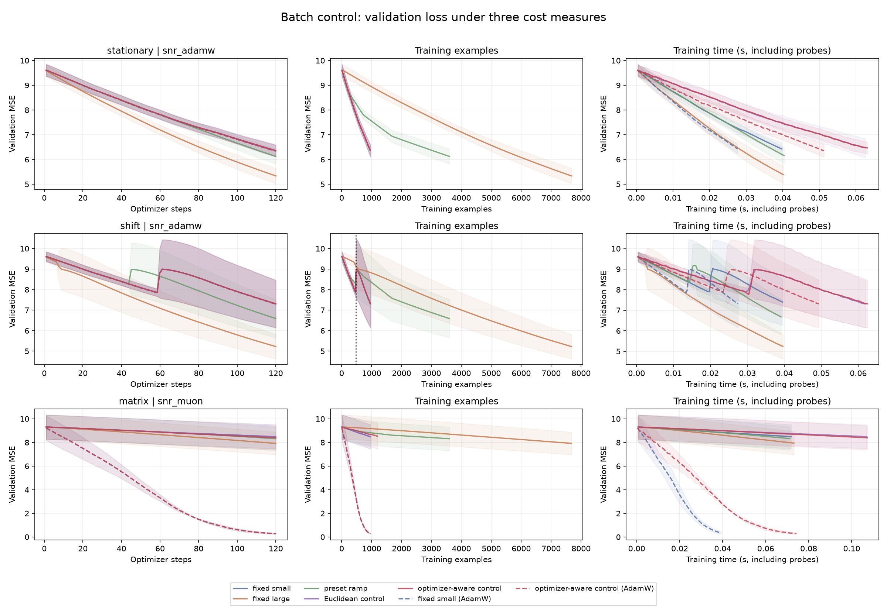

**Controller behavior and cost.** The controllers now move among several candidate batches, particularly on the matrix task. The controller smooths the raw scales, applies a deadband, and limits changes to one rung. Probing every five steps is a material fraction of elapsed training time on this tiny CPU workload.

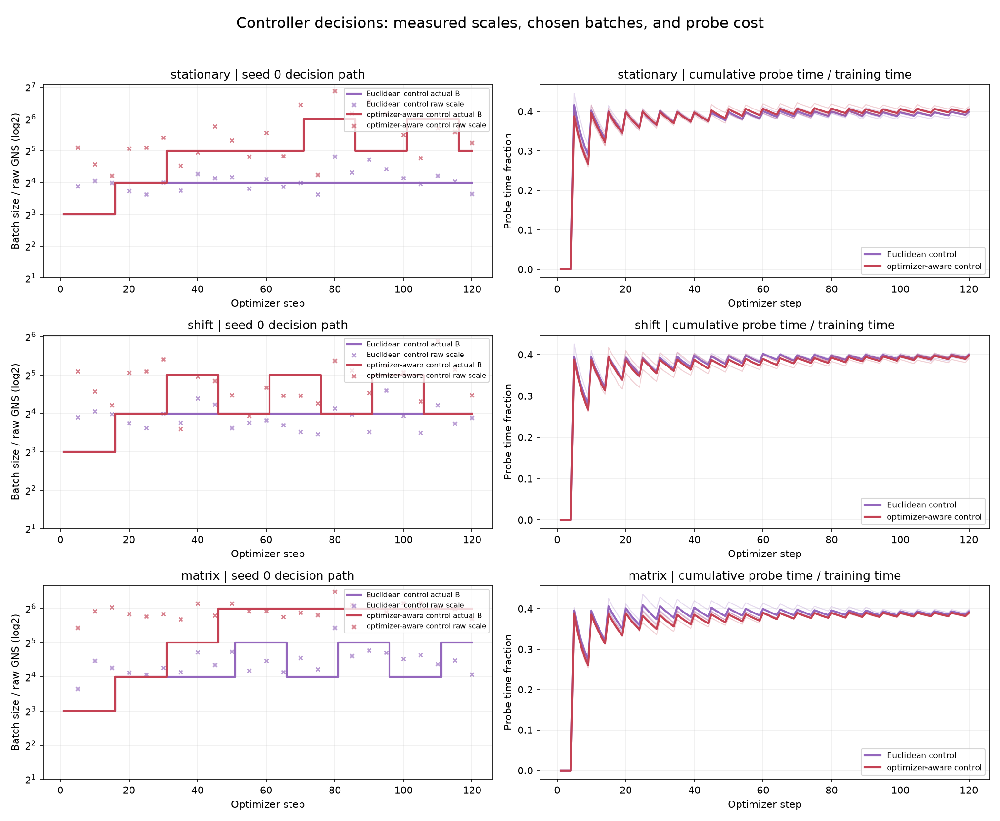

**Measured local batch range.** Four-step continuations at each candidate batch show the per-step and per-example trade-off from a shared mid-run checkpoint. The right panels compare raw noise scales with the smallest batch reaching 80% of the best measured per-step gain. Three seeds and four continuation steps make this a diagnostic, not a calibrated critical-batch estimate.

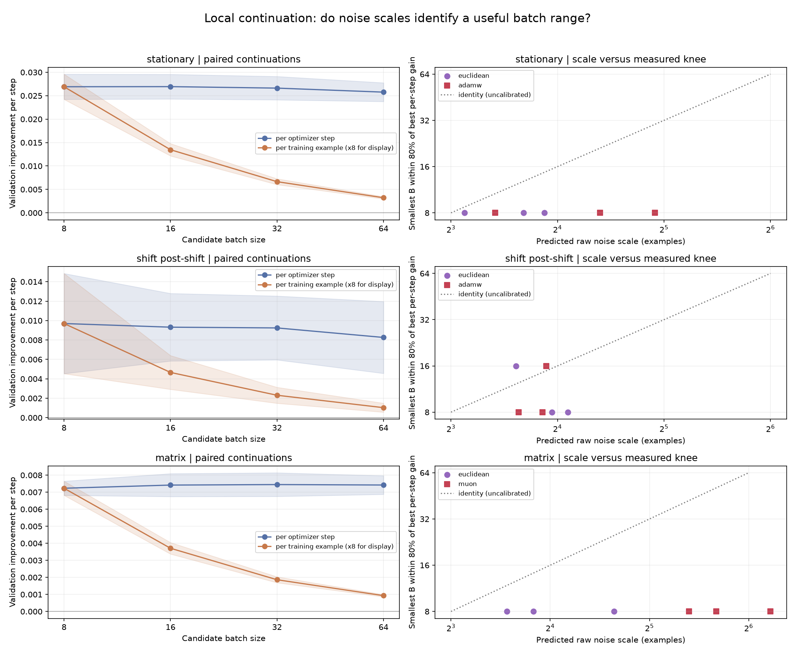

**Gate coupling.** Mean SNRAdamW gate values differ across batch policies; changing the actual batch also changes finite-dataset alpha and the gating trajectory. This is a confound to measure when testing a batch controller on gated optimizers.

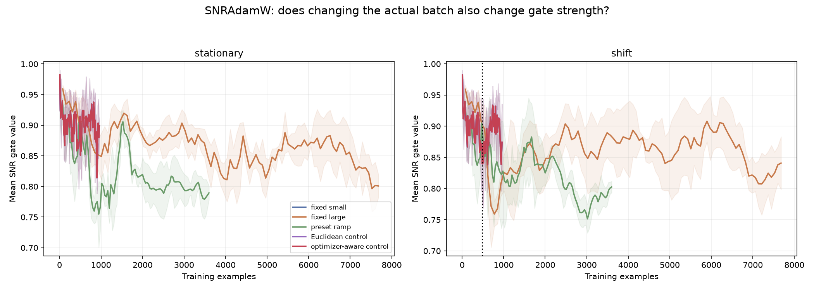

**Output:** `benchmarks/benchmark_batch_control_{frontiers,diagnostics,calibration,gates}.png` and `benchmarks/benchmark_batch_control.jsonl.gz`.

## Held-out handwritten digits and probe resolution

**Reproducibility note (27 September 2026):** The figures and tables immediately
below were generated before fixing the Muon row-covariance calculation. They
document the initial experiment but their Muon scale, aware-controller paths,
and comparisons are superseded by the corrected rerun below. Fixed-batch
trajectories and local improvement curves do not depend on that sensor. AdamW
decisions also depend on CPU probe timing; the previous reported AdamW outcomes
are not stable under a change of execution environment.

The larger experiment uses the real scikit-learn digits images, a held-out validation split, and a `64→128→64→10` classifier. `digits_shift` changes every training and validation label by `+3 mod 10` after 1,500 training examples; the images remain the same. Development seeds 0–1 informed the fixed learning rates (SNRMuon `0.1`, AdamW `0.003`) and the heuristic sensor multiplier `0.2`; the figures below use held-out seeds 2–6. Every policy has a 3,000-training-example cap, while the separate probe examples and CPU probe time are logged. The fixed `B=16` control is a useful practical reference. Run:

```bash
python benchmark_batch_control.py --tasks digits digits_shift --seed-start 2 --seeds 5 --steps 750 --sample-budget 3000 --sizes 4 8 16 32 64 128 --reference-batch 16 --probe-every 20 --probe-size 64 --probe-splits 8 --target-multiplier 0.2 --muon-lr 0.1 --adamw-lr 0.003 --calibration-points quarters --continuation-steps 12 --output benchmarks/benchmark_batch_control_digits.jsonl.gz
python plot_batch_control.py benchmarks/benchmark_batch_control_digits.jsonl.gz --tasks digits digits_shift --tag digits_
python benchmark_batch_probe_resolution.py
```

At the sample cap, mean validation cross-entropy over five held-out seeds is:

| Task / optimizer | B=4 | B=16 | B=128 | Ramp | Euclidean | Aware |
| --- | ---: | ---: | ---: | ---: | ---: | ---: |
| Digits / SNRMuon | 0.165 | 0.166 | 0.629 | 0.166 | 0.166 | 0.161 |
| Shift / SNRMuon | 0.199 | 0.336 | 1.733 | 0.286 | 0.225 | 0.250 |
| Digits / AdamW | 0.197 | 0.185 | 0.738 | 0.169 | 0.156 | 0.168 |
| Shift / AdamW | 0.255 | 0.474 | 1.810 | 0.413 | 0.293 | 0.243 |

The stationary SNRMuon difference between aware and fixed `B=16` is only −0.0055 mean cross-entropy (paired standard deviation 0.0126). Under the label shift, aware SNRMuon is worse than fixed `B=4` in every seed (mean difference +0.0507). Stationary SNRMuon takes about 0.55 CPU seconds with aware control versus 0.25 with fixed `B=16`; on this small model, probes consume about 26% of the aware run's measured time. AdamW adaptive probes consume roughly 46%. Thus the current optimizer-aware policy does not establish a better loss/cost frontier than the fixed or Euclidean controls. These are fixed-learning-rate, CPU-only results; no GPU throughput or coupled batch/LR claim follows.

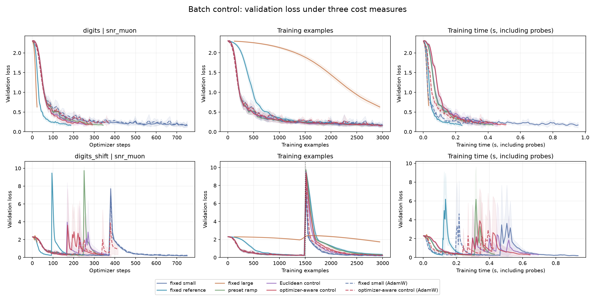

The sample axis aligns the label change across policies; the step axis shows each policy reaching it at a different step. Controller decisions and paired local 12-step continuations before and after the shift are shown separately. Local curves measure short-horizon gains from a shared checkpoint, not a universal critical batch size.

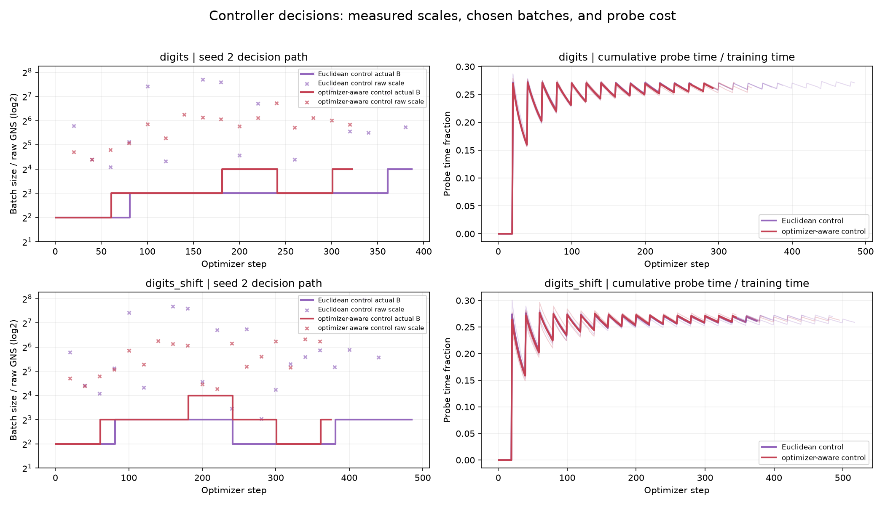

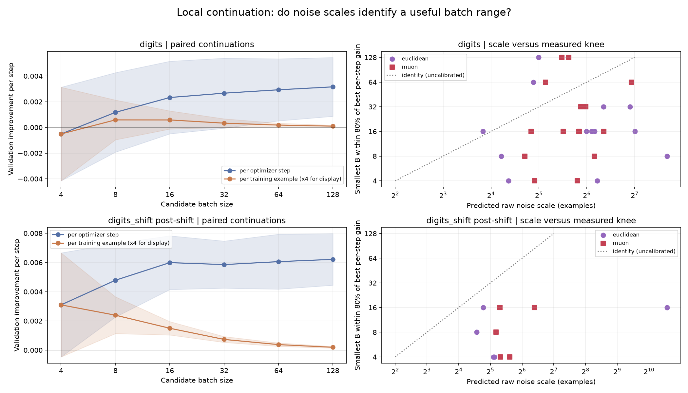

At a fixed trained checkpoint, the resolution experiment reuses the same 128 digit examples and varies the number of disjoint microbatches. The initial run reported a median raw Muon scale of about 143 at eight splits and 350 at 128 splits; these values used the incorrect flattening. Six of 30 Euclidean scale estimates had no resolved signal. The 128-split result is still a finite-sample reference, not population truth. The multiplier calibrated with eight splits should not be transferred to another probe resolution without recalibration.

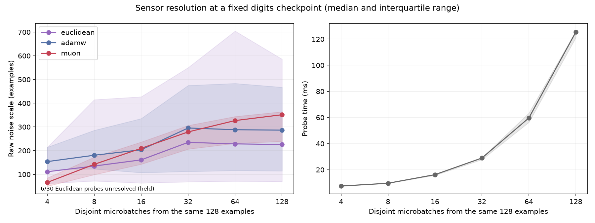

**Initial output:** `benchmarks/benchmark_batch_control_digits.jsonl.gz` and the three `benchmark_batch_control_digits_*.png` figures. The probe-resolution JSON and PNG have since been regenerated with the corrected formula.

### Corrected covariance and probe-cost ablation

The Muon sensor now estimates `C_row = b/(K-1) Σ R_k R_kᵀ` using the singular
values of the centered matrix gradients concatenated along columns. The
previous code flattened each matrix, which instead measured variation across
microbatches. An analytic rank-two test checks the distinction. On the same
128 digit examples at a fixed checkpoint, the corrected median Muon scale is
164 with eight splits and 224 with 128 splits (five seeds); median probe time
in this CPU rerun is 13 and 127 ms respectively. The resolution dependence
remains, though its old numerical description is invalid.

The corrected digit rerun uses the original learning rates, `0.2` multiplier,
five seeds, example cap, and probe schedule, with four selected policies. The
multiplier was selected against the **old** geometry, so these outcomes test
that frozen choice after a bug fix, rather than a recalibrated sensor. Mean
final validation cross-entropy:

| Task / optimizer | Fixed B=4 | Fixed B=16 | Euclidean | Aware, guarded |
| --- | ---: | ---: | ---: | ---: |
| Digits / SNRMuon | 0.165 | 0.166 | 0.166 | 0.160 |
| Shift / SNRMuon | 0.199 | 0.336 | 0.225 | 0.244 |
| Digits / AdamW | 0.197 | 0.185 | 0.197 | 0.228 |
| Shift / AdamW | 0.255 | 0.474 | 0.243 | 0.292 |

The guarded AdamW result is especially sensitive to execution time: at the
configured limit of 15 times the preceding training step, `expensive_probe`
accounts for 167/168 aware decisions on stationary digits and 163/165 after
the shift. The corresponding Euclidean controller holds for 185/185 and
183/184 decisions. These paths mostly remain at `B=4`, so they do not validate
the scale. With the guard set effectively infinite, aware AdamW moves up to
`B=32` and ends at mean CE 0.184 stationary and **0.863 shifted**; permissive
Euclidean control ends at 0.168 and 0.276. All five permissive aware shifted
seeds are worse than their Euclidean counterparts. This guard ablation changes
the control policy as well as its outcome; CPU wall times are device and load
dependent, and this permissive setting is diagnostic rather than economical.

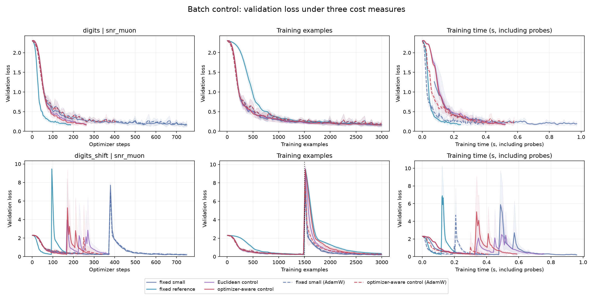

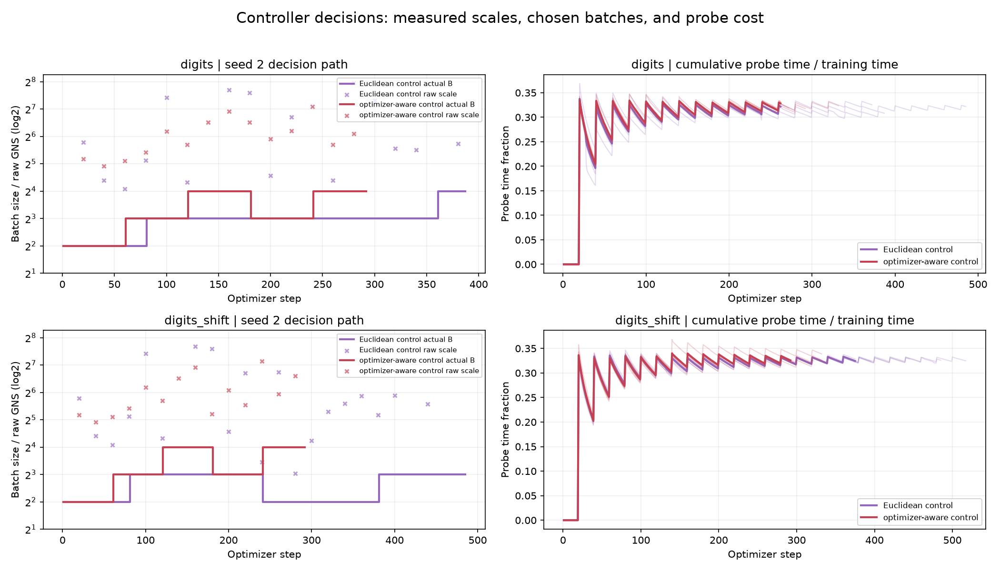

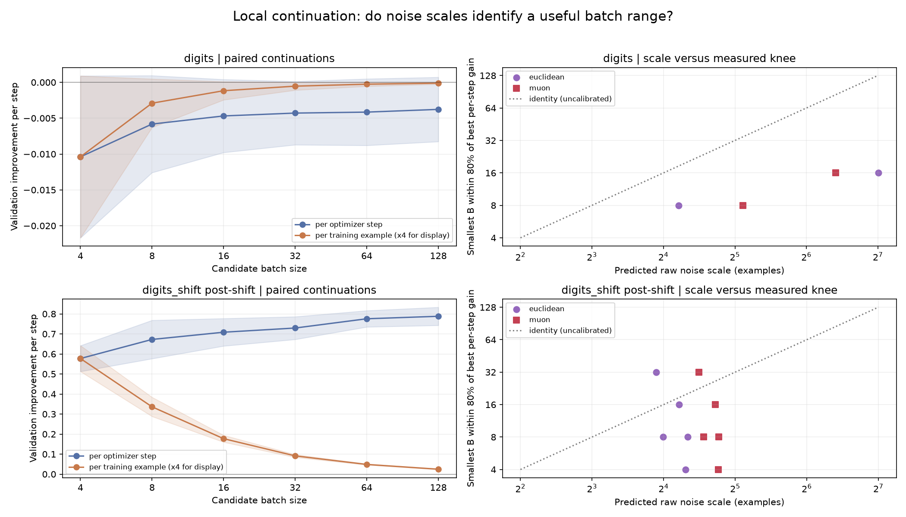

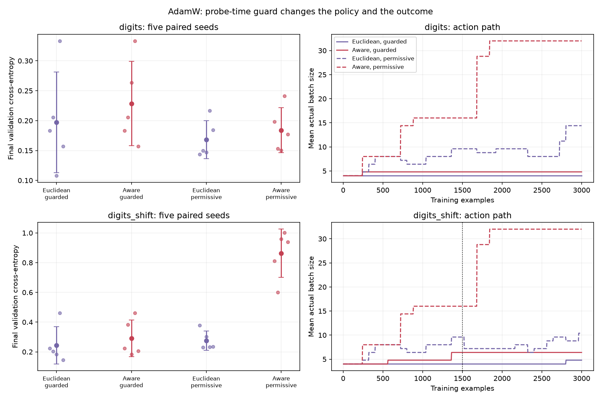

An exploratory SNRMuon multiplier sweep on the **same** five shifted-digit
seeds tests sensitivity after correcting the geometry. Multipliers 0.05,
0.1, 0.2, and 0.4 give mean final CE 0.199, 0.208, 0.244, and 0.375;
their mean batch sizes are 4.0, 5.0, 9.3, and 12.3. At 0.05 the policy
never leaves B=4 and reproduces the fixed-small trajectory exactly. A
smaller multiplier recovers sample efficiency here by behaving increasingly
like the fixed-small baseline. These seeds have now been inspected repeatedly;
the sweep is a mechanism check, not independent hyperparameter validation.

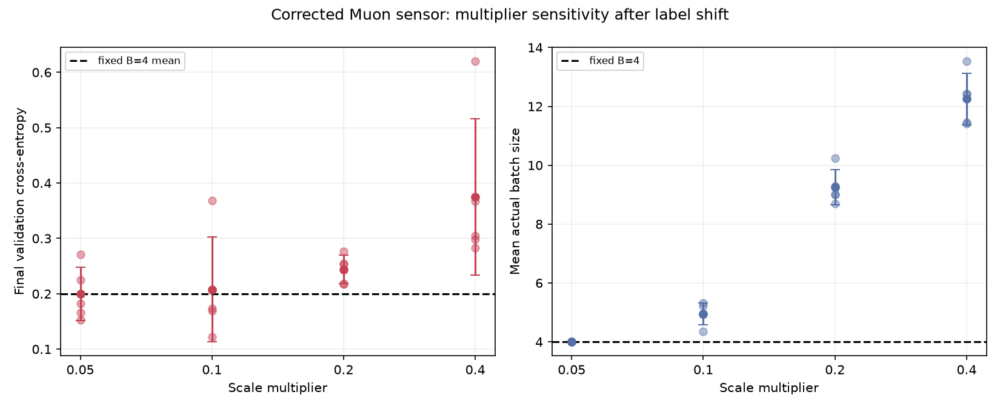

The corrected records and figures are `benchmark_batch_control_corrected.jsonl.gz`,
`benchmark_batch_control_corrected_*.png`, `benchmark_batch_control_no_guard.jsonl.gz`,
`benchmark_batch_guard_ablation.png`, `benchmark_batch_muon_multiplier_*.jsonl.gz`,
`benchmark_batch_muon_multiplier.png`, and `benchmark_batch_probe_resolution.{json,png}`
in `benchmarks/`. Reproduce the guarded run with the digit command above,
adding `--policies fixed_small fixed_reference euclidean aware --max-probe-fraction 15`
and changing `--output` to the corrected filename. For the guard ablation add
`--optimizers adamw --policies euclidean aware --max-probe-fraction 1000000000`;
then run `plot_batch_guard_ablation.py` on both JSONL files. Use
`plot_batch_control.py ... --tasks digits digits_shift --tag corrected_` for
the three corrected digit figures.

## Why the digit controller misses the useful batch

The follow-up outcomes below are historical runs made with the old Muon
sensor; its replicated local **loss gains** are unchanged, but their attached
probe scales were regenerated with the corrected formula. Controller policy
outcomes below should be interpreted as mechanism diagnostics, not corrected
sensor results. The corrected guarded comparison is in the section above.

The original sensor multiplier was fitted to a **per-step** local batch knee, but the held-out comparison capped **training examples**. To separate that objective mismatch from response lag, a follow-up repeats 12-step paired local continuations eight times at each fixed checkpoint and adds fixed `B=8`, a known-change-point `B=16→4` schedule, a controller reset at the known change point, and a reset triggered by a training-loss spike. The last two change-point schedules are diagnostic controls; the known-change-point policies receive privileged timing information. The exploratory loss alarm compares the current training loss with a 0.95 EMA and fires above `max(1, 4 × EMA)`, with an 80-step cooldown. Its threshold was not selected by a separate alarm-validation experiment.

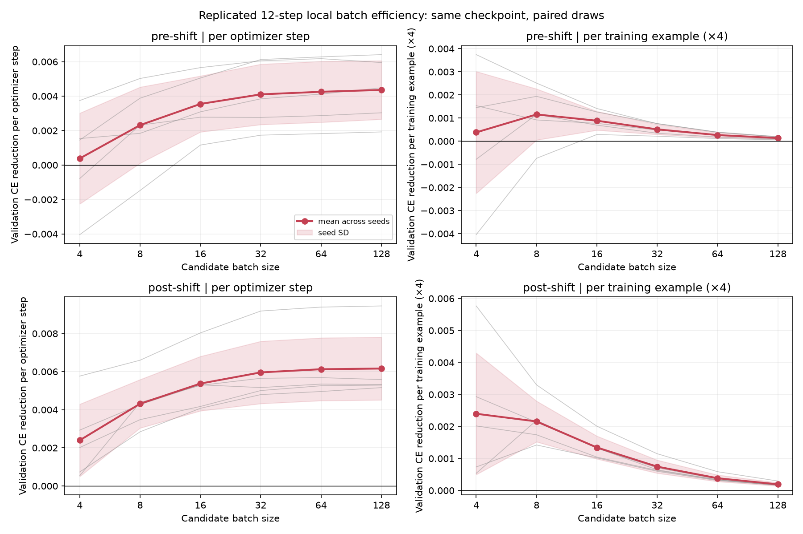

Across the five post-shift checkpoints, the batch with the greatest **mean per-step** gain is `B=64` or `128` in all five seeds; the batch with the greatest **mean per-example** gain is `B=4` in three seeds and `B=8` in two. The same checkpoints have corrected raw eight-split Muon scale estimates of roughly 43–104. Per-repetition 80%-of-best knees vary widely even at identical parameters, so a single 12-step knee is noisy. The controller's `0.2` multiplier tends to choose `B=8–16`, which improves updates per step but uses some of the limited example budget less efficiently. The shaded region is standard deviation across five independent splits after averaging eight paired draws within each split.

At 3,000 training examples, mean validation cross-entropy across the same five held-out seeds is:

| Shift / optimizer | B=4 | B=8 | B=16 | Aware | Oracle B=16→4 | Oracle aware reset | Loss-alarm reset |
| --- | ---: | ---: | ---: | ---: | ---: | ---: | ---: |
| All labels / SNRMuon | 0.199 | 0.253 | 0.336 | 0.250 | 0.203 | 0.219 | 0.204 |
| All labels / AdamW | 0.255 | 0.288 | 0.474 | 0.243 | 0.274 | 0.219 | 0.217 |
| Classes 0↔1 / SNRMuon | 0.172 | 0.192 | 0.198 | 0.173 | 0.209 | — | 0.178 |
| Classes 0↔1 / AdamW | 0.220 | 0.191 | 0.215 | 0.251 | 0.202 | — | 0.180 |

The all-label reset result shows that part of the previous aware-control gap is delayed response to the change. It does not establish a sensor advantage: fixed `B=4` nearly matches the reset outcomes without probe cost, and the two-class shift does not reward resetting SNRMuon. On stationary digits, the loss alarm fires spuriously for SNRMuon in three of five seeds and AdamW in all five. On the all-label shift, it fires on the first shifted minibatch in four of five SNRMuon seeds; a false alarm before the shift blocks the fifth by cooldown. AdamW produces frequent false alarms. These results are exploratory: the alarm and follow-up task were designed after inspecting the initial held-out results, so fresh tasks and seeds are needed to assess generalization.

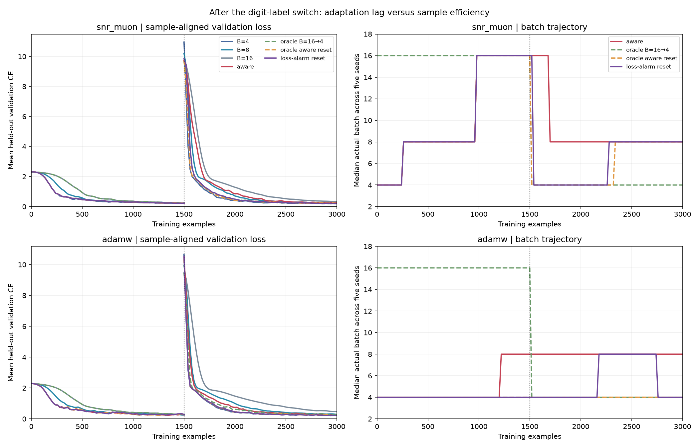

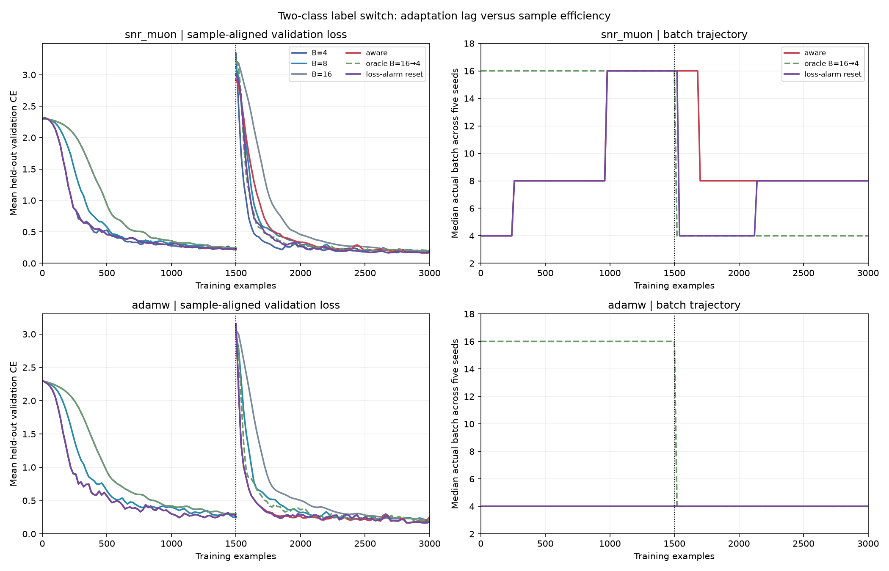

The scripts retain all trajectories and paired local repetitions. To reproduce the follow-up with the same hyperparameters as the original digit run, use:

```bash
python benchmark_batch_local_replication.py
python benchmark_batch_control.py --tasks digits digits_shift --policies fixed_mid shift_reset aware_shift_reset --seed-start 2 --seeds 5 --steps 750 --sample-budget 3000 --sizes 4 8 16 32 64 128 --reference-batch 16 --probe-every 20 --probe-size 64 --probe-splits 8 --target-multiplier 0.2 --muon-lr 0.1 --adamw-lr 0.003 --output benchmarks/benchmark_batch_control_ablation.jsonl.gz
python benchmark_batch_control.py --tasks digits digits_shift --policies aware_alarm --seed-start 2 --seeds 5 --steps 750 --sample-budget 3000 --sizes 4 8 16 32 64 128 --reference-batch 16 --probe-every 20 --probe-size 64 --probe-splits 8 --target-multiplier 0.2 --muon-lr 0.1 --adamw-lr 0.003 --output benchmarks/benchmark_batch_control_alarm.jsonl.gz
python benchmark_batch_control.py --tasks digits_partial_shift --policies fixed_small fixed_mid fixed_reference aware shift_reset aware_alarm --seed-start 2 --seeds 5 --steps 750 --sample-budget 3000 --sizes 4 8 16 32 64 128 --reference-batch 16 --probe-every 20 --probe-size 64 --probe-splits 8 --target-multiplier 0.2 --muon-lr 0.1 --adamw-lr 0.003 --output benchmarks/benchmark_batch_control_partial_shift.jsonl.gz
python plot_batch_control_failure_modes.py
python plot_batch_control_failure_modes.py --partial
```

## Held-out checkpoint test of budget-aware batch decisions

`benchmark_batch_budget.py` tests whether the corrected sensors **predict** a
useful batch outside the fixed-small trajectory. For each of five evaluation
digit splits (seeds 2–6), it saves pre- and post-shift checkpoints from fixed
`B=4`, `16`, and `64` training. At every checkpoint it measures the corrected
eight-split probe on 64 examples, then makes three independently paired,
eight-step continuations at `B=4,8,16,32,64` from identical model and optimizer
states. The same candidate draw prefix is used within each repetition. A
five-nearest-neighbor calibration fitted **only on seeds 0–1** predicts the
batch with highest gain per processed example or CPU second. Its Euclidean and
optimizer-aware versions are compared with the best constant batch selected
on the development seeds. The shift phase is never passed to the predictor.

The example objective charges the adaptive policy for its 64 probe examples
amortized over 20 training steps; the time objective likewise charges measured
probe CPU time. The constant comparator incurs neither charge. The local
oracle chooses the best no-probe candidate separately at each held-out
checkpoint and is an unattainable lower bound on decision regret. A separate
no-probe counterfactual isolates sensor prediction from probe cost.

Mean regret to this local oracle across 30 held-out checkpoints per optimizer
(lower is better; cross-entropy reduction per resource unit):

| Optimizer / resource | Constant | Euclidean | Aware |
| --- | ---: | ---: | ---: |
| SNRMuon / example, charged | 0.000517 | 0.002450 | 0.002388 |
| SNRMuon / example, probes free | 0.000517 | 0.000699 | 0.000638 |
| SNRMuon / CPU second, charged | 0.310 | 5.999 | 5.999 |
| SNRMuon / CPU second, probes free | 0.310 | 0.310 | 0.358 |
| AdamW / example, charged | 0.000661 | 0.002343 | 0.002240 |
| AdamW / example, probes free | 0.000661 | 0.000661 | 0.000661 |
| AdamW / CPU second, charged | 1.033 | 16.761 | 16.769 |
| AdamW / CPU second, probes free | 1.033 | 1.121 | 1.033 |

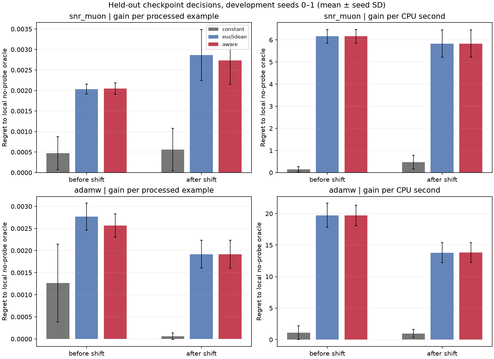

The fitted example-budget policy sometimes chooses larger batches but does
not outperform fixed `B=4`; with no probe charge, its small remaining
differences do not show an optimizer-specific advantage. The CPU-time
calibration largely chooses the same batch as the constant policy (`B=64`
for SNRMuon, usually `B=32` for AdamW), so its large charged regret is mainly
the cost of probing, not wrong batch choices. These are *offline decisions*,
not an end-to-end rollout: changing a batch changes future checkpoints.
The short-horizon local oracle can itself be noisy, and CPU times need not
transfer to GPU. The earlier five evaluation seeds have already been examined
in this PR, so the outcome is exploratory rather than a fresh confirmation.

Run from a checkout with the development dependencies installed:

```bash
python benchmark_batch_budget.py --output benchmarks/benchmark_batch_budget.json.gz
python plot_batch_budget.py benchmarks/benchmark_batch_budget.json.gz benchmarks/benchmark_batch_budget.png
```

The JSON includes every repetition, aggregated candidate curves, and held-out
decisions. The fitting rule scores each feasible candidate directly under a
specified example or time budget; it does not map a raw noise scale to a batch
with a fixed multiplier. With the present measurements, there is no evidence
to justify rolling that fitted rule into the live controller.

## On-policy rollout and generalization check

`benchmark_batch_rollout.py` freezes the development-only calibration above,
then actually applies the predicted batch at the next step. Seeds 11–15 have
shared, example-indexed training draws across policies. The complete study
has two optimizers and four tasks: stationary digits, the +3 label shift,
90-degree rotation of digit images with unchanged labels, and a separate
shifted-target matrix regression problem. Each run stops at **3,000 training
examples**, with any batch crossing the change at 1,500 shortened. All
adaptive policies start at `B=4`; their 64-example, eight-split probes run
every 20 steps. Training plus probe CPU time and processed probe examples are
recorded separately from validation work. The comparison includes every
fixed size `B=4,8,16,32,64`, the development-selected fast fixed size, and
Euclidean and optimizer-aware policies for both explicit cost objectives.

An initial run was excluded after an audit found that adaptive policies had
started at the fast fixed size instead of `B=4`. The 400-policy corrected run
was repeated with all arms interleaved in randomized order. A post-hoc
no-probe `20 steps at B=4 → fast fixed size` control adds 40 trajectories.
The initial outcomes exposed seeds 11–15 before this correction, so the
corrected comparisons remain exploratory rather than independent confirmation.

Mean final validation loss across five seeds (CE for digits, MSE for matrix):

| Task / optimizer | Best fixed size, loss¹ | Euclidean / example | Aware / example | Aware / time |
| --- | ---: | ---: | ---: | ---: |
| Stationary / SNRMuon | B=8, 0.179 | 0.205 | 0.177 | 0.282 |
| Shift / SNRMuon | B=4, 0.199 | 0.220 | 0.258 | 1.075 |
| Rotation / SNRMuon | B=4, 0.249 | 0.277 | 0.284 | 0.973 |
| Matrix shift / SNRMuon | B=8, 0.159 | 0.182 | 0.169 | 4.461 |
| Stationary / AdamW | B=4, 0.184 | 0.179 | 0.185 | 0.297 |
| Shift / AdamW | B=4, 0.203 | 0.222 | 0.231 | 0.748 |
| Rotation / AdamW | B=4, 0.258 | 0.238 | 0.264 | 0.718 |
| Matrix shift / AdamW | B=4, 0.177 | 0.183 | 0.177 | 4.001 |

**Correction (review):** the "Aware / time" column is not a fair score. Those
policies optimize gain per CPU second but are judged here at an example cap;
see the review at the top of this page for their time-matched losses.

¹ The best fixed size is identified **after** looking at these results. It
describes the fixed-batch frontier, not a deployable task-selection policy.
The full summary includes all fixed sizes, the preset warmup and both time
policies, every seed, total examples including probes, and elapsed CPU time.

The small stationary SNRMuon mean advantage over fixed `B=8` is −0.0017 CE,
with a paired standard deviation of 0.0275, while taking roughly 1.35 versus
0.86 CPU seconds and processing another 1,203 probe examples on average.
Under the +3 label shift, aware SNRMuon is worse than fixed `B=4` in **all
five** new splits (paired mean +0.0598 CE); on rotated images it is worse in
four of five. On the separate matrix regression task it does not exceed the
fixed `B=8` sample endpoint. AdamW-aware example control has no consistent
advantage over Euclidean control. Some aware time policies improve on the
preset warmup's final loss, but their results are generally matched or
bettered at comparable time by a fixed intermediate batch. Per-seed dominance
against the fixed and warmup controls, and the complete paths, are in the
summary and figures.

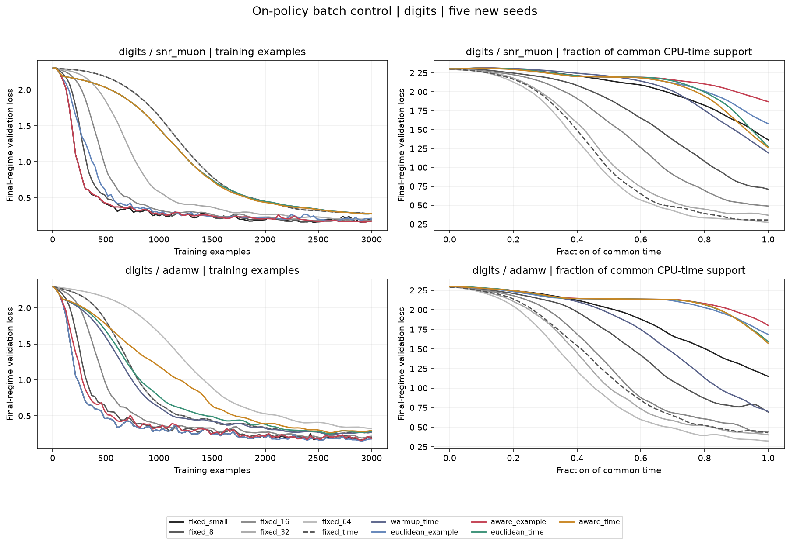

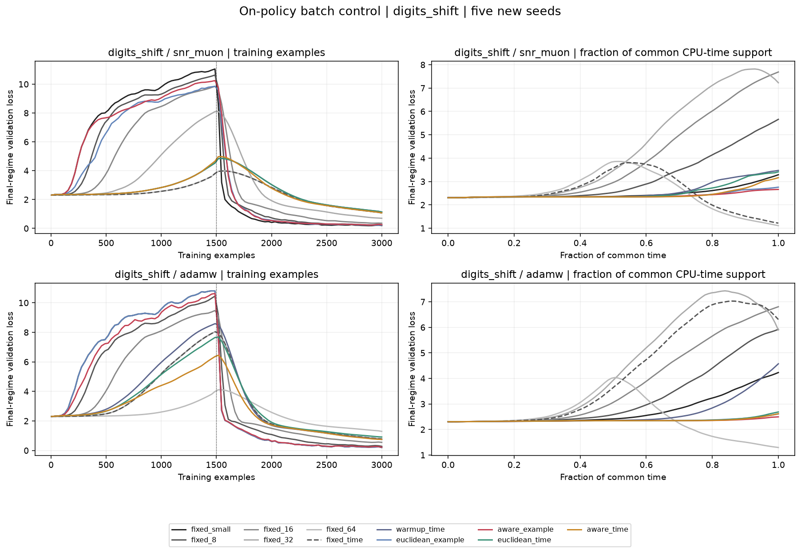

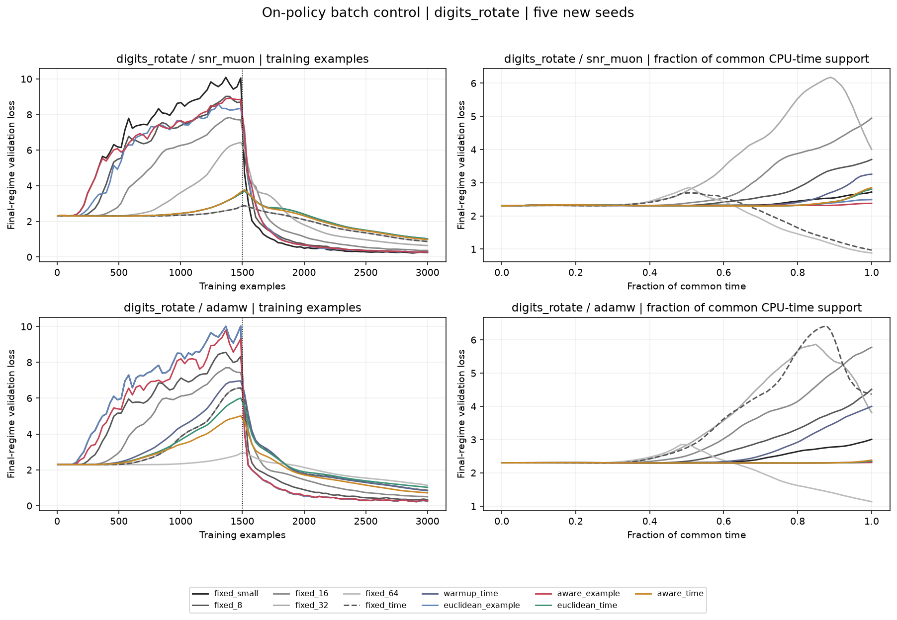

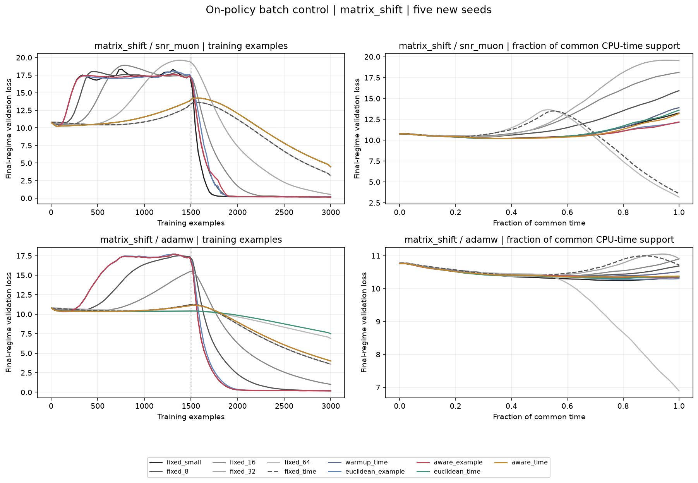

The time panels align each seed only over the time all policies reached; before
the change point they evaluate against the **final** regime, so early losses
are intentionally high for policies still training on the original labels.
CPU timings of the post-hoc warmup schedule were obtained in a separate pass.
These tasks remain small CPU workloads with fixed learning rates, and the
digits variants share one underlying dataset. They cannot settle whether
an optimizer-aware controller helps on a model and GPU where larger batches
improve hardware throughput. On these workloads the present policy has no
reliable loss/resource frontier advantage.

The exact corrected per-step records are stored as seven parts in
`benchmarks/benchmark_batch_rollout_parts/`, with an archive digest checked
by `plot_batch_rollout.py`. The no-probe warmup records and per-seed summary
are separate. To regenerate the complete study and figures locally:

```bash
python benchmark_batch_rollout.py --output benchmarks/benchmark_batch_rollout_corrected.jsonl.gz
python benchmark_batch_rollout.py --policies warmup_time --output benchmarks/benchmark_batch_rollout_warmup.jsonl.gz
python plot_batch_rollout.py benchmarks/benchmark_batch_rollout_corrected.jsonl.gz benchmarks/benchmark_batch_rollout_warmup.jsonl.gz
```

To redraw from the committed observations, replace the first plot input with
`benchmarks/benchmark_batch_rollout_parts`. The experiment specification and
excluded-first-pass explanation are in
`docs/proposals/batch-control-on-policy-study.md`.
